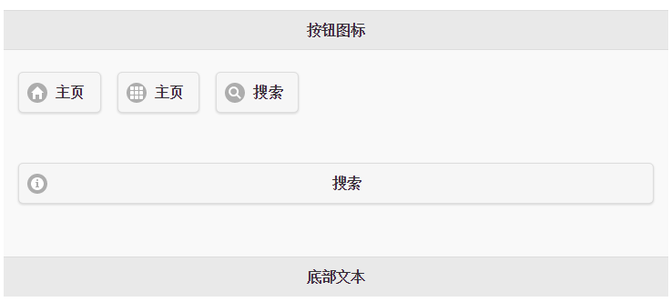

# jQuery Mobile 按钮图标

jQuery Mobile 提供了一套让按钮看起来更称心如意的图标。



## 添加图标到 jQuery Mobile 按钮

如需添加图标到您的按钮，请使用 data-icon 属性：

```
<a href="#anylink" data-role="button" data-icon="search">Search</a>
```

**提示：**您也可以在 &lt;button&gt; 或 &lt;input&gt; 元素上使用 data-icon 属性。

下面我们列出一些 jQuery Mobile 提供的可用图标：

| 属性值 | 描述 | 图标 | 实例 |
| :-- | :-- | :-- | :-- |
| data-icon="arrow-l" | 左箭头 |
| data-icon="arrow-r" | 右箭头 |
| data-icon="delete" | 删除 |
| data-icon="info" | 信息 |
| data-icon="home" | 首页 |
| data-icon="back" | 后退 |
| data-icon="search" | 搜索 |
| data-icon="grid" | 网格 |

如需查看所有 jQuery Mobile 按钮图标的完整参考手册，请访问我们的 [jQuery Mobile 图标参考手册](jquerymobile-ref-icons.html)。

## 定位图标

您也可以规定图标定位在按钮的什么部位：顶部（top）、右侧（right）、底部（bottom）、左侧（left）。

请使用 data-iconpos 属性来指定位置：

## 图标的位置：

```
<a href="#link" data-role="button" data-icon="search" data-iconpos="top">顶部</a>
<a href="#link" data-role="button" data-icon="search" data-iconpos="right">右侧</a>
<a href="#link" data-role="button" data-icon="search" data-iconpos="bottom">底部</a>
<a href="#link" data-role="button" data-icon="search" data-iconpos="left">左侧</a>

```

> 
> 默认情况下，所有的按钮图标被放置到左侧。 

## 只显示图标

如果只想显示图标，请设置 data-iconpos 为 "notext"：

## 后退：

```
<a href="#link" data-role="button" data-icon="search" data-iconpos="notext">搜索</a>

```
