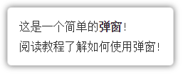

# jQuery Mobile 工具栏

## jQuery Mobile 工具栏

工具栏元素通常位于头部和尾部内 - 让导航易于访问：



## 头部栏

头部栏一般包含页面标题/logo 或一两个按钮（通常是首页、选项或搜索）。

您可以添加按钮到头部的左侧或右侧。

下面的代码，将添加一个按钮到头部标题文本的左侧，添加一个按钮到头部标题文本的右侧：

## 实例

```
<div data-role="header">
<a href="#" data-role="button">首页</a>
<h1>欢迎来到我的主页</h1>
<a href="#" data-role="button">搜索</a>
</div>
```

下面的代码，将添加一个按钮到头部标题文本的左侧：

```
<div data-role="header">
<a href="#" data-role="button">首页</a>
<h1>欢迎来到我的主页</h1>
</div>
```

但是，如果您把按钮链接放置在 &lt;h1&gt; 元素之后，将无法显示右侧的文本。要添加一个按钮到头部标题的右侧，请指定 class 为 "ui-btn-right"：

## 实例

```
<div data-role="header">
<h1>欢迎来到我的主页</h1>
<a href="#" data-role="button" class="ui-btn-right">搜索</a>
</div>
```

> 
> 头部可以包含一个或两个按钮，而尾部没有限制。 

## 尾部栏

尾部栏比头部栏更灵活 - 在整个页面中它们更具功能性和可变性，因此可以包含尽可能多的按钮：

## 实例

```
<div data-role="footer">
<a href="#" data-role="button">在 Facebook上关注我</a>
<a href="#" data-role="button">在Twitter上关注我</a>
<a href="#" data-role="button">在Instagram上关注我</a>
</div>
```

**注意：**尾部的样式与头部不同（没有内边距和空间，且按钮不居中）。为了解决这个问题，请把 "ui-btn" 放置在尾部的 class 上：

## 实例

```
<div data-role="footer" class="ui-btn">
```

您还可以将尾部中的按钮进行水平或垂直组合：

## 实例

```
<div data-role="footer" class="ui-btn">
<div data-role="controlgroup" data-type="horizontal">
<a href="#" data-role="button" data-icon="plus">在Facebook上关注我</a>
<a href="#" data-role="button" data-icon="plus">在Twitter上关注我</a>
<a href="#" data-role="button" data-icon="plus">在Instagram上关注我</a>
</div>
</div>
```

## 定位头部栏和尾部栏

头部和尾部可以通过三种方式进行定位：

*   Inline - 默认。头部栏和尾部栏与页面内容内联。
*   Fixed - 头部栏和尾部栏固定在页面的顶部和底部。
*   Fullscreen - 与 Fixed 定位模式基本相同，头部栏和尾部栏固定在页面的顶部和底部。但是当他工具栏滚动出屏幕之外时，不会自动重新显示，除非点击屏幕，这对于图片或视频类有提升代入感的应用是非常有用的。注意这种模式下工具栏会遮住页面内容，所以最好用在比较特殊的场合下。

使用 data-position 属性来定位头部栏和尾部栏：

## Inline 定位（默认）

```
<div data-role="header" data-position="inline"></div>
<div data-role="footer" data-position="inline"></div>
```

## Fixed 定位

```
<div data-role="header" data-position="fixed"></div>
<div data-role="footer" data-position="fixed"></div>
```

要启用全屏定位，请使用 data-position="fixed"，并添加 data-fullscreen 属性到元素：

## Fullscreen 定位

```
<div data-role="header" data-position="fixed" data-fullscreen="true"></div>
<div data-role="footer" data-position="fixed" data-fullscreen="true"></div>
```

**提示：**全屏定位适用于照片、图像和视频。

**提示：**固定定位和全屏定位中，通过点击屏幕将隐藏和显示头部栏和尾部栏。
